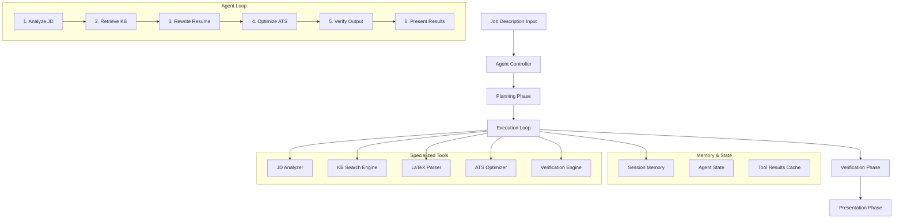

# Design Document

## Overview

This design transforms Resumeness from a simple text rewriter into a truly autonomous AI agent that follows a rigorous 6-step optimization loop. The agent will operate independently with planning, execution, verification, and self-critique capabilities, implementing the ReAct (Reasoning Acting) pattern with persistent memory and state management.

The core innovation is replacing the current Esingle-response chat interface with an autonomous agent that executes a mandatory loop: **Analyze → Retrieve → Rewrite → Optimize → Verify → Present**. This ensures consistent, thorough optimization while maintaining factual accuracy and professional formatting.

## Architecture

### Agent Architecture Pattern

The system implements a **ReAct-based autonomous agent** with the following architectural components:



### Core Components

1. **Agent Controller**: Orchestrates the entire optimization process
2. **Planning Engine**: Creates internal execution plans before acting
3. **Memory Manager**: Maintains state across the entire session
4. **Tool Orchestrator**: Manages specialized tools and their interactions
5. **Verification Engine**: Performs self-critique and quality assurance
6. **State Machine**: Ensures proper step sequencing and error recovery

## Components and Interfaces

### 1. Agent Controller

```typescript
interface AgentController {
  executeOptimization(jobDescription: string): Promise<OptimizationResult>
  getCurrentState(): AgentState
  resetSession(): void
}

interface AgentState {
  currentStep: AgentStep
  sessionId: string
  startTime: Date
  planningResults: PlanningResults
  executionHistory: ExecutionStep[]
  verificationResults: VerificationResults
}

enum AgentStep {
  PLANNING = 'planning',
  ANALYZING = 'analyzing', 
  RETRIEVING = 'retrieving',
  REWRITING = 'rewriting',
  OPTIMIZING = 'optimizing',
  VERIFYING = 'verifying',
  PRESENTING = 'presenting',
  COMPLETED = 'completed',
  ERROR = 'error'
}
```

### 2. Planning Engine

```typescript
interface PlanningEngine {
  createExecutionPlan(jobDescription: string): Promise<ExecutionPlan>
  updatePlan(step: AgentStep, results: any): Promise<ExecutionPlan>
}

interface ExecutionPlan {
  targetRole: string
  requiredSkills: SkillCategory[]
  atsKeywords: string[]
  seniorityLevel: SeniorityLevel
  industryTerms: string[]
  optimizationStrategy: OptimizationStrategy
  estimatedDuration: number
}

interface SkillCategory {
  type: 'hard' | 'soft'
  skills: string[]
  priority: number
}
```

### 3. Memory Manager

```typescript
interface MemoryManager {
  storeSessionData(key: string, data: any): void
  retrieveSessionData(key: string): any
  getExecutionHistory(): ExecutionStep[]
  persistState(): Promise<void>
  loadState(sessionId: string): Promise<AgentState>
}

interface ExecutionStep {
  step: AgentStep
  timestamp: Date
  input: any
  output: any
  duration: number
  success: boolean
  errorMessage?: string
}
```

### 4. Specialized Tools

```typescript
interface JobDescriptionAnalyzer {
  extractRoleTitle(jd: string): Promise<string>
  categorizeSkills(jd: string): Promise<SkillCategory[]>
  extractATSKeywords(jd: string): Promise<string[]>
  determineSeniority(jd: string): Promise<SeniorityLevel>
  identifyIndustryTerms(jd: string): Promise<string[]>
}

interface KnowledgeBaseSearchEngine {
  searchRelevantExperience(query: string, limit: number): Promise<RankedResult[]>
  rankByRelevance(items: KnowledgeItem[], criteria: string[]): RankedResult[]
  identifyGaps(required: string[], available: KnowledgeItem[]): string[]
}

interface ATSOptimizer {
  calculateScore(resume: string, keywords: string[]): Promise<ATSScore>
  optimizeKeywordDensity(content: string, keywords: string[]): Promise<string>
  validateNaturalFlow(content: string): Promise<boolean>
  explainScoreImprovement(before: ATSScore, after: ATSScore): string[]
}
```

### 5. Verification Engine

```typescript
interface VerificationEngine {
  verifyFactualAccuracy(content: string, knowledgeBase: KnowledgeItem[]): Promise<VerificationResult>
  validateLaTeXSyntax(latex: string): Promise<ValidationResult>
  detectRedundancy(content: string): Promise<RedundancyReport>
  performSelfCritique(result: OptimizationResult): Promise<CritiqueResult>
}

interface VerificationResult {
  isAccurate: boolean
  inaccuracies: Inaccuracy[]
  confidence: number
}

interface ValidationResult {
  isValid: boolean
  errors: LaTeXError[]
  warnings: LaTeXWarning[]
}
```

## Data Models

### Core Data Structures

```typescript
interface OptimizationResult {
  sessionId: string
  originalResume: string
  optimizedResume: string
  atsScoreBefore: number
  atsScoreAfter: number
  changesApplied: ChangeDescription[]
  executionTime: number
  verificationPassed: boolean
}

interface ChangeDescription {
  section: string
  changeType: 'content' | 'structure' | 'keywords'
  description: string
  impact: string
  confidence: number
}

interface RankedResult {
  item: KnowledgeItem
  relevanceScore: number
  matchingCriteria: string[]
  suggestedUsage: string
}

interface ATSScore {
  overall: number
  keywordCoverage: number
  keywordDensity: number
  naturalFlow: number
  matchedKeywords: string[]
  missingKeywords: string[]
}
```

### Agent Configuration

```typescript
interface AgentConfig {
  maxRetries: number
  timeoutPerStep: number
  atsTargetScore: number
  keywordCoverageThreshold: number
  verificationStrictness: 'low' | 'medium' | 'high'
  enableSelfCritique: boolean
  cacheResults: boolean
}
```

## Correctness Properties

*A property is a characteristic or behavior that should hold true across all valid executions of a system—essentially, a formal statement about what the system should do. Properties serve as the bridge between human-readable specifications and machine-verifiable correctness guarantees.*

### Property Reflection

After analyzing all acceptance criteria, I identified several areas where properties can be consolidated:

**Redundancy Analysis:**
- Properties 1.1-1.5 all relate to agent loop execution and can be combined into comprehensive loop behavior properties
- Properties 2.1-2.6 all relate to job description analysis and can be consolidated into analysis completeness properties  
- Properties 3.1-3.6 all relate to knowledge base retrieval and can be combined into retrieval effectiveness properties
- Properties 4.1-4.6 all relate to content rewriting and can be consolidated into rewriting correctness properties
- Properties 5.1-5.6 all relate to ATS optimization and can be combined into optimization effectiveness properties
- Properties 6.1-6.6 all relate to verification and can be consolidated into verification completeness properties
- Properties 7.1-7.6 relate to result presentation (7.6 is not testable due to subjectivity)
- Properties 8.1-8.6 all relate to tool usage and can be consolidated into tool orchestration properties
- Properties 9.1-9.6 all relate to error handling and can be consolidated into resilience properties
- Properties 10.1-10.6 all relate to performance and can be consolidated into efficiency properties

### Consolidated Correctness Properties

**Property 1: Agent Loop Execution Completeness**
*For any* job description input, the agent should execute all 6 steps of the Agent_Loop in sequence, maintain state throughout execution, retry failed steps up to 3 times, and present a comprehensive summary upon completion.
**Validates: Requirements 1.1, 1.2, 1.3, 1.4, 1.5**

**Property 2: Job Description Analysis Accuracy**
*For any* job description, the analysis phase should extract role title, categorize all skills as hard/soft, identify at least 15 ATS keywords, classify seniority level correctly, identify industry terms, and output an internal plan before execution.
**Validates: Requirements 2.1, 2.2, 2.3, 2.4, 2.5, 2.6**

**Property 3: Knowledge Base Retrieval Effectiveness**
*For any* search query, the retrieval system should rank results by relevance score (0-100), prioritize matching technologies/skills, prefer quantified achievements, flag missing data when gaps exist, retrieve at least 3 items per section, and request information when no relevant items found.
**Validates: Requirements 3.1, 3.2, 3.3, 3.4, 3.5, 3.6**

**Property 4: Content Rewriting Correctness**
*For any* resume section being rewritten, the system should preserve LaTeX structure, use job-aligned language, inject quantified impact, never hallucinate experience, prioritize job-mentioned skills, and emphasize relevant technologies.
**Validates: Requirements 4.1, 4.2, 4.3, 4.4, 4.5, 4.6**

**Property 5: ATS Optimization Effectiveness**
*For any* resume optimization, the system should achieve 70%+ keyword coverage, avoid keyword stuffing, maintain professional structure, calculate ATS scores (0-100), explain improvements, and revert changes that decrease scores.
**Validates: Requirements 5.1, 5.2, 5.3, 5.4, 5.5, 5.6**

**Property 6: Verification Completeness**
*For any* optimization result, the verification system should cross-reference all claims against knowledge base, validate LaTeX compilation, remove redundancy automatically, fix issues without user intervention, perform verification after every rewrite, and escalate to user after 3 failed attempts.
**Validates: Requirements 6.1, 6.2, 6.3, 6.4, 6.5, 6.6**

**Property 7: Result Presentation Completeness**
*For any* completed optimization, the presentation should include updated LaTeX resume, before/after ATS scores, 3-5 bullet points explaining changes, identification of modified sections with reasons, and quantified impact metrics.
**Validates: Requirements 7.1, 7.2, 7.3, 7.4, 7.5**

**Property 8: Tool Orchestration Correctness**
*For any* agent operation, the system should use Knowledge_Base search before content generation, use LaTeX parser for LaTeX operations, use ATS scoring after rewrites, maintain conversation memory, gracefully degrade when tools unavailable, and log all tool usage.
**Validates: Requirements 8.1, 8.2, 8.3, 8.4, 8.5, 8.6**

**Property 9: Error Resilience**
*For any* error condition, the system should continue with cached data when offline, automatically fix common LaTeX errors, request information when knowledge base empty, retry operations up to 3 times with exponential backoff, preserve original resume on critical errors, and provide clear error messages with remediation steps.
**Validates: Requirements 9.1, 9.2, 9.3, 9.4, 9.5, 9.6**

**Property 10: Performance Efficiency**
*For any* optimization request, the system should complete the Agent_Loop in under 60 seconds, use efficient search algorithms for large knowledge bases, cache analysis results for reuse, minimize API calls while maintaining functionality, provide offline responses within 10 seconds, and optimize memory usage for large documents.
**Validates: Requirements 10.1, 10.2, 10.3, 10.4, 10.5, 10.6**

## Error Handling

### Error Recovery Strategy

The agent implements a multi-layered error recovery approach:

1. **Step-Level Retry**: Each agent step retries up to 3 times with exponential backoff
2. **Graceful Degradation**: When tools fail, the agent continues with cached data or simulated responses
3. **State Preservation**: Original resume is always preserved before modifications
4. **User Escalation**: After 3 failed attempts, the agent requests user guidance
5. **Rollback Capability**: Automatic reversion when ATS scores decrease

### Error Categories

```typescript
enum ErrorType {
  NETWORK_ERROR = 'network_error',
  TOOL_UNAVAILABLE = 'tool_unavailable', 
  LATEX_SYNTAX_ERROR = 'latex_syntax_error',
  KNOWLEDGE_BASE_EMPTY = 'knowledge_base_empty',
  VERIFICATION_FAILED = 'verification_failed',
  TIMEOUT_ERROR = 'timeout_error',
  CRITICAL_ERROR = 'critical_error'
}

interface ErrorHandler {
  handleError(error: ErrorType, context: any): Promise<ErrorResolution>
  shouldRetry(error: ErrorType, attemptCount: number): boolean
  getRecoveryStrategy(error: ErrorType): RecoveryStrategy
}
```

## Testing Strategy

### Dual Testing Approach

The system requires both unit testing and property-based testing for comprehensive coverage:

**Unit Tests:**
- Specific examples of job description parsing
- Edge cases for empty knowledge bases
- Error conditions and recovery scenarios
- Integration points between components
- LaTeX compilation validation

**Property-Based Tests:**
- Universal properties across all inputs (100+ iterations minimum)
- Comprehensive input coverage through randomization
- Agent loop execution completeness
- Content rewriting correctness
- ATS optimization effectiveness

### Property Test Configuration

Each property test will:
- Run minimum 100 iterations with randomized inputs
- Reference specific design document properties
- Use tag format: **Feature: agentic-resume-optimizer, Property {number}: {property_text}**
- Generate realistic job descriptions, knowledge bases, and resume content
- Validate agent behavior across diverse scenarios

### Testing Framework Integration

The system will integrate with existing testing infrastructure:
- **Jest** for unit tests and test orchestration
- **fast-check** for property-based testing (JavaScript/TypeScript)
- **Custom generators** for domain-specific test data (job descriptions, resumes, knowledge items)
- **Mock services** for external dependencies (Ollama, database)
- **Performance benchmarks** for efficiency properties

The testing strategy ensures that the autonomous agent behaves correctly across all possible inputs while maintaining the required performance characteristics and error resilience.